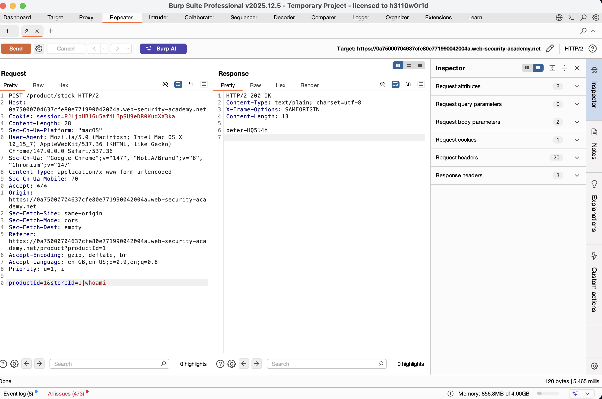
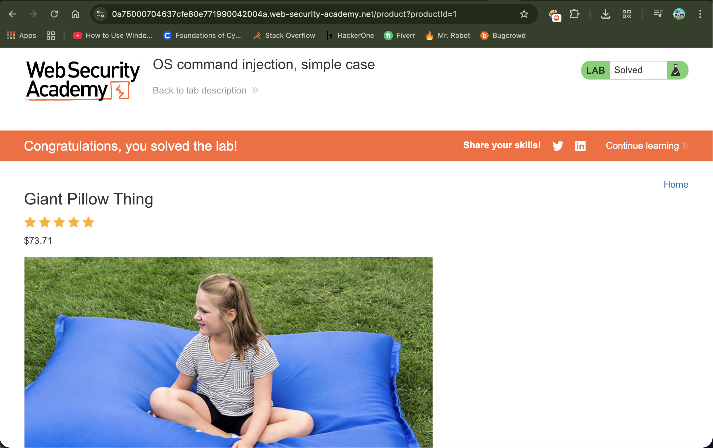

# Lab: OS Command Injection, Simple Case

---

## 📌 Summary

The application contains an OS command injection vulnerability in the product stock checker functionality.

User-supplied input from the `storeId` parameter is concatenated directly into a system command without proper sanitization, allowing arbitrary operating system commands to be executed on the server.

---

## 🧾 Description

The vulnerability occurs because the application executes shell commands using unsanitized user input.

The stock checker feature accepts `productId` and `storeId` parameters and passes them directly into a backend shell command. By injecting shell metacharacters such as `|`, an attacker can append additional commands.

In this lab, the injected `whoami` command is executed to determine the current operating system user running the web server.

The response reveals the username returned from the operating system command execution.

---

## 🔁 Steps to Reproduce

1. Open the lab application
2. Intercept the stock check request using Burp Suite
3. Send the request to Burp Repeater
4. Locate the `storeId` parameter in the request body
5. Modify the parameter value from:

```http
storeId=1
```

to:

```http
storeId=1|whoami
```

6. Send the modified request
7. Observe the response containing the output of the `whoami` command

---

## 📸 Proof of Concept (PoC)


### 1. Injecting the whoami Command



### 2. Server Responding with Current User



---

## 💥 Impact

This vulnerability allows attackers to execute arbitrary operating system commands on the server.

As a result:

* Attackers may gain remote code execution capabilities
* Sensitive server information can be disclosed
* Files and system configurations may be accessed or modified
* The underlying operating system may become fully compromised
* Further privilege escalation attacks may become possible

---

## 🛠️ Remediation

To fix this issue:

* Never pass unsanitized user input into system shell commands
* Use safe APIs instead of shell execution whenever possible
* Apply strict input validation and allowlisting
* Escape shell metacharacters properly
* Run applications with least privilege permissions
* Implement server-side monitoring and logging for suspicious command execution attempts

---

## 📚 Notes

This issue demonstrates a classic **OS Command Injection** vulnerability caused by insecure handling of user-controlled input within backend system commands.

Attackers can abuse shell operators such as:

```bash
|
&&
;
||
```

to append malicious commands and execute them on the target server.
