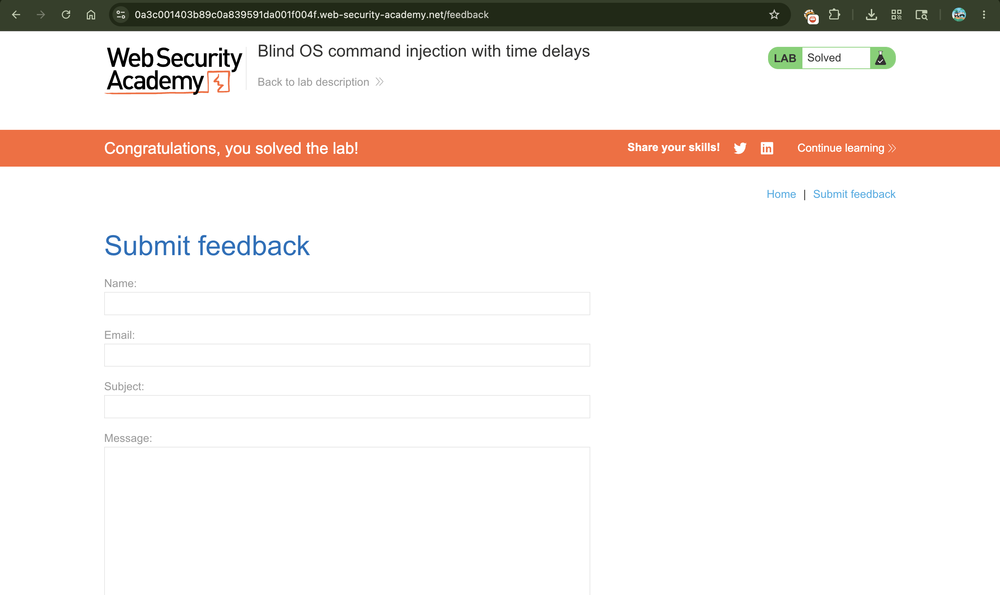

# Lab: Blind OS Command Injection with Time Delays

---

## 📌 Summary

The application is vulnerable to **Blind OS Command Injection** within its feedback submission feature.

Unlike "In-band" injection, the server does not return the command output in its response. However, the vulnerability can still be confirmed by injecting commands that cause a measurable **time delay**, such as `sleep`.

---

## 🧾 Description

The vulnerability exists in the feedback form where user-supplied data (specifically the `email` field) is processed by a backend shell command.

Because the application doesn't show the output of these commands, we use a **time-based technique**. By injecting a command like `sleep 10`, we force the server to wait for 10 seconds before sending a response. If the response is delayed by exactly that amount, it proves the command was executed successfully.

---

## 🔁 Steps to Reproduce

1. Open the lab and navigate to the **Submit feedback** page.
2. Fill out the form and click "Submit feedback" while intercepting the request with **Burp Suite**.
3. Send the intercepted `POST /feedback/submit` request to **Burp Repeater**.
4. Locate the `email` parameter in the request body.
5. Modify the `email` value to include a sleep command using the `&` (background) or `||` (OR) operator:

```http
email=sam@gmail.com%26+sleep+10+%23
```

*(Note: `%26` is the URL-encoded version of `&`, and `%23` is `#` to comment out the rest of the original command.)*

6. Send the request.
7. Observe that the "Response received" timer in Burp Suite shows a delay of approximately **10 seconds**.

---

## 📸 Proof of Concept (PoC)

### 1. Injecting the Sleep Payload


### 2. Lab Successfully Solved



---

## 💥 Impact

Even though we cannot "see" the output immediately, this vulnerability is critical:

* **System Reconnaissance:** Attackers can use time delays to "guess" file names or database content (e.g., "If file exists, sleep 10").
* **Data Exfiltration:** Attackers can trigger out-of-band requests (like DNS or HTTP) to send private data to their own servers.
* **Full Compromise:** It can lead to complete server takeover by downloading and executing malicious scripts.

---

## 🛠️ Remediation

* **Avoid Shell Commands:** Use built-in language APIs (like Python’s `subprocess` with arguments, or PHP’s `mail()`) instead of calling the shell directly.
* **Input Validation:** Use a strict "allowlist" for email formats.
* **Sanitize Input:** If you must use shell commands, escape all special characters (like `&`, `|`, `;`, `$`) before processing.

---

## 📚 Notes

In **Blind Injection**, you are essentially "talking" to the server in a game of Hot or Cold.

Common operators for this attack:

* `&` : Executes the command in the background.
* `&&` : Executes only if the first command succeeds.
* `||` : Executes only if the first command fails.
* `;` : Executes sequentially.