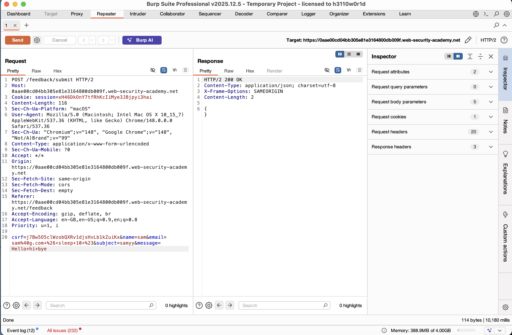
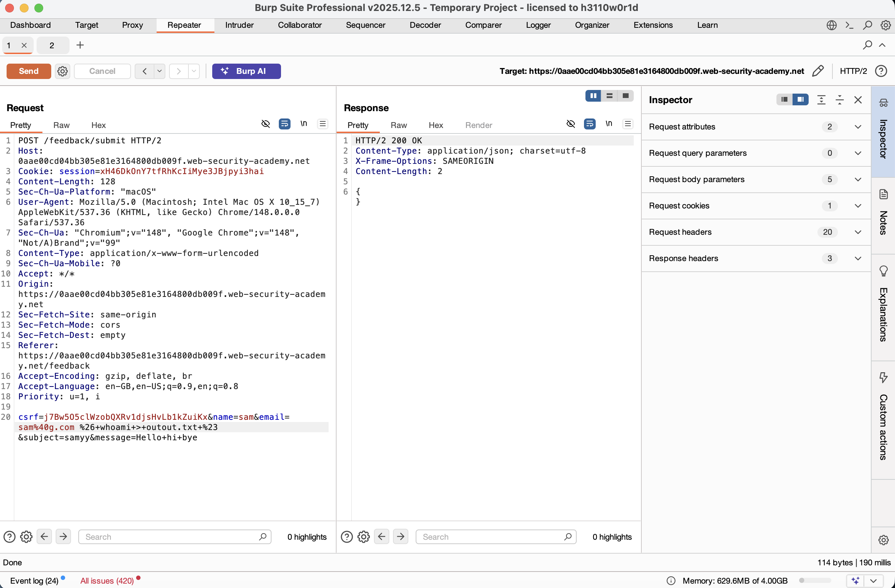
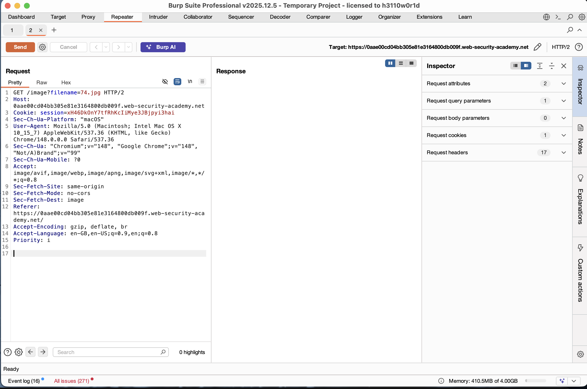
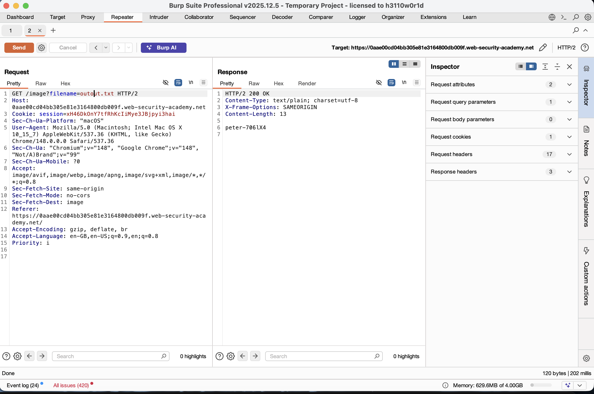

# Lab: Blind OS Command Injection with Output Redirection

---

## 📌 Summary

The application is vulnerable to **Blind OS Command Injection**. While the server doesn't return the command output directly, we can redirect that output into a file within the web root and then read it using the site's image-loading functionality.

---

## 🧾 Description

The vulnerability is located in the feedback submission feature. By injecting a command into the `email` field, we can force the server to execute system-level commands.

Since the response is "blind" (doesn't show output), we use the `>` operator to save the result of our command (like `whoami`) into a text file. Later, we access that file through a different part of the application that fetches static files.

---

## 🔁 Steps to Reproduce

1. Open the lab and go to the **Submit feedback** page.
2. Fill the form and intercept the request using **Burp Suite**.
3. Send the `POST /feedback/submit` request to **Burp Repeater**.
4. In the `email` parameter, inject a command to run `whoami` and save it to a file:

```http
email=sam@40g.com%26+whoami+>+outout.txt+%23
````

*(Note: `%26` is `&` and `+` represents spaces. This creates a file named `outout.txt` on the server.)*

5. Now, find a request that loads an image (e.g., `GET /image?filename=74.jpg`).
6. Send this request to **Repeater** and change the filename to your new file:

```http
GET /image?filename=outout.txt
```

7. Send the request, and the server will return the output of the `whoami` command (e.g., `peter-706lX4`).

---

## 📸 Proof of Concept (PoC)

### 1. Confirming Vulnerability with Sleep



### 2. Redirecting Command Output



### 3. Capturing Random Image Request




### 4. Reading the Exfiltrated Data



---

## 💥 Impact

This vulnerability is highly dangerous because:

* **Data Theft:** Attackers can read sensitive system files like `/etc/passwd`.
* **Persistence:** Attackers can create their own files or scripts on the server.
* **Full Control:** It allows the attacker to explore the internal environment and potentially take over the entire server.

---

## 🛠️ Remediation

* **Input Filtering:** Never trust user input. Use strict validation to ensure the email field only contains a valid email address.
* **Use Secure APIs:** Instead of using shell commands to process feedback, use built-in programming functions that don't involve the OS shell.
* **File System Permissions:** The web application should not have "write" permissions to folders where it can also "read" or execute files.
